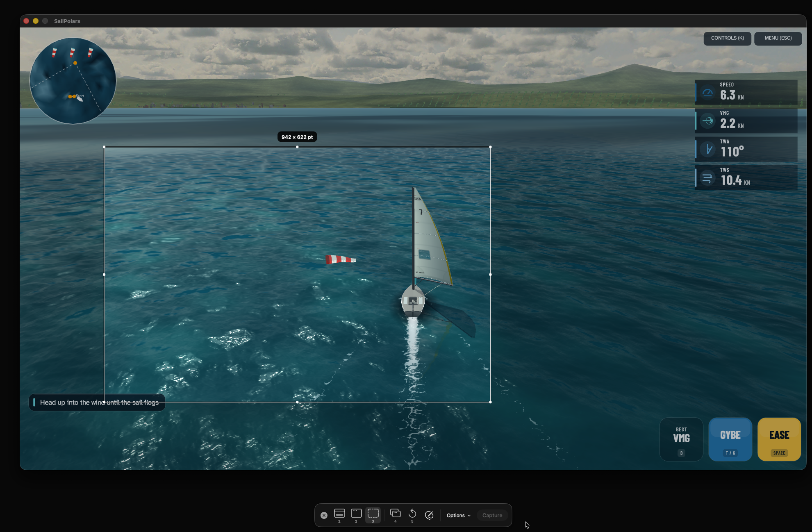

# Shotglass

A native Apple Silicon macOS capture utility inspired by CleanShot X, built in Swift, SwiftUI, AppKit, ScreenCaptureKit, Vision, and AVFoundation. Uses macOS Liquid Glass through native `glassEffect`, `GlassEffectContainer`, and glass button styles. No subscription or account required. Direct downloads use Sparkle for updates.



## Run

Source repository: [mscno/shotglass](https://github.com/mscno/shotglass) (public).

Open `dist/Shotglass.app`. Launching or reopening the app shows a compact Liquid Glass capture bar at the bottom of the current display. The capture bar and transparent selector open together, without waiting for desktop frames. Escape works throughout startup. The last capture mode and area are remembered across launches. There is no Dock icon, persistent menu-bar item, global hotkey registration, or login launch. Capture or cancel ends the session and exits the process. Settings and Library open only when requested. If you enable the optional thumbnail, Shotglass exits after it disappears; explicitly opened editors, pins, recordings, and library windows keep the session active until finished.

For a permanent installation, copy the app to `/Applications` or `~/Applications` before enabling permissions. Requires an Apple Silicon Mac (M1 or newer) running macOS 26 or later. Intel builds are intentionally excluded.

If prompted, allow Screen Recording in **System Settings → Privacy & Security → Screen & System Audio Recording**. On older macOS versions this section is called Screen Recording. Relaunch after changing the permission if macOS requests it. Camera and microphone permissions are requested only when those recording options are enabled. Automatic scrolling and shortcut display during recordings additionally require Accessibility access; ordinary screenshots and local capture keys do not.

## Capture workflow

The selector uses clear, nonopaque AppKit panels. macOS renders the actual windows, video and games underneath directly; Shotglass draws only the selection border, resize handles, translucent window tint and outside dimming. There is no desktop-preview capture stream, screenshot backdrop, image copying or preview frame-rate limit. Clear pixels still belong to the selector's native input surface, so clicking, dragging or scrolling cannot reach apps below. Nonactivating panels keep the underlying app active while accepting local capture keys. Window mode refreshes window metadata; screen and area mode require none to open. Escape cancels from the selector, Options popover or text fields and ends the on-demand session.

- **Full screen:** a thin inset border follows the display under the pointer, with its name and capture resolution in pixels. Move to another display to switch targets, then click it or press Return to capture.
- **Active window:** capture the frontmost window of the app you were using before opening Shotglass.
- **Choose window:** hover to see a blue outline and tint, the app icon/name, and the window title, then click it. Window positions and front-to-back ordering update during selection. The window is captured independently, without surrounding apps.
- **Area (default):** your last rectangle is already selected. Drag inside to move it, drag a handle to resize it, or drag outside to replace it. Press Return or click Capture when ready. Moving/resizing never captures on release. When the rectangle overlaps the bottom toolbar, the toolbar fades out in 0.16 seconds and stops intercepting clicks. Move or resize the rectangle clear of the toolbar to fade it back in over 0.2 seconds. The rectangle stays visible, keys 1–5/Return/Escape remain available, and Reduce Motion is respected.
- **Draw new:** click Draw new or press **N**, then draw anywhere, including inside the old area. Drag or click two corners; hold Shift while dragging for a square. The bar waits for Return/Capture by default. Enable **Options → Snap on draw** to capture and close immediately after drawing a new rectangle, including drawing outside the old area or clicking two corners. The toggle is remembered across launches; moving or resizing an existing area still waits for Capture. The explicit `shotglass://draw` launcher command captures a new area immediately on release. Areas can span displays.
- **Last area:** capture your previous selection immediately. Choose Last area in the bar to recall and adjust it first. If the saved display was disconnected, the bar brings the rectangle onto the current screen.
- **Preset area:** enter an exact size in the overlay, or save your last area as a named preset. Selection dimensions are in logical screen points; screenshots preserve the display's native pixel density.

Open Shotglass from Applications, Spotlight, or Raycast. The numbered mode icons match **1–5 from left to right: Full screen, Choose window, Area, Active window, Last area**. While the capture bar is focused, press **A** for area, **D/N** to draw a new rectangle, **F/S** for full screen, **W** for a window, **V** for the active window, or **R** to recall the last area. **Return** captures; **Esc** cancels and quits. **Tab/Shift-Tab** cycles modes and **Space** toggles area/window. **⌘L** opens Library; **⌘,** opens basic Settings. Arrow keys move an existing region by one point; Shift-arrow moves it by ten. These keys never intercept typing in another application.

The compact icon toolbar follows [Apple's Screenshot panel](https://support.apple.com/guide/mac-help/mh26782/mac): screen/window/area first, additional tools in a second group, then Options and Capture. It uses system light/dark appearance, native Liquid Glass, neutral selection highlights, and alternating black/white dashed region borders with larger circular resize handles, and a camera pointer for window capture. Options contains the timer, exact size, saved areas, clipboard and folder toggles, Snap on draw, Quick Preview, Settings, and Library. Hover a mode or button for its name, shortcut and a short explanation. Tooltips appear after a brief delay above the capture overlay, follow the currently hovered control, and never steal focus or intercept clicks.

Every screenshot saves as **PNG** to **`~/Documents/Screenshots`** and copies to the clipboard by default. The clipboard includes both the image and its file URL, allowing image pasting and file pasting. Recordings use a file URL; GIFs also include their animated GIF data. Filenames include milliseconds and a unique suffix to prevent rapid captures from overwriting each other.

Still captures use macOS's native screenshot dimensions. Area captures crop integer pixels from the native display image without resizing; window captures retain the full window and optional shadow without fitting them into a smaller video surface. PNG exports preserve the original pixel dimensions, transparency and color profile. A selection measured in points produces twice as many pixels on a 2× Retina display. Mixed-density captures use the highest density among the captured displays, with no smoothing when combining them. JPEG export and an explicit editor Resize remain separate choices. Existing blurred captures must be taken again; PNG encoding cannot restore detail lost during an earlier capture.

Enable **Options → Quick Preview · 3 seconds** to show a small thumbnail sliding into the bottom right. It stays for three seconds, slides out in 0.14 seconds, and then the app quits when the session is otherwise idle. Click the thumbnail to open the editor. Rapid captures replace the thumbnail and restart its timer; every completed capture keeps its own file, while the clipboard holds the latest. Relaunching during an active capture queues the newest request until the current write finishes. No background service, daemon, or login item is used.

Configure the destination, PNG/JPEG format, clipboard behavior, capture delay, shadows, cursor, and recording settings in Settings. With folder saving disabled, captures remain in an internal history directory. Removing an item from history preserves its file.

## Keys while capture is open

| Action | Key |
| --- | --- |
| Area · reuse/adjust rectangle | 3 or A |
| Draw a fresh rectangle | D or N |
| Full screen | 1 or F or S |
| Choose window | 2 or W |
| Active window | 4 or V |
| Recall last area | 5 or R |
| Capture | Return |
| Cancel and quit | Esc |
| Basic Settings | ⌘, |
| Library | ⌘L |

There are no system-wide capture shortcuts. If you want a launch shortcut, assign one to the Shotglass command in Raycast; Shotglass itself only needs to run during a capture session. When upgrading, older global-shortcut preferences are ignored and an enabled Shotglass login item is unregistered. Quit older running Shotglass copies to release their previous global shortcuts.

## Raycast and launcher integration

Install Shotglass in `~/Applications` or `/Applications`. Add **`integrations/raycast`** through **Raycast Settings → Extensions → + → Add Script Directory**, then type **shot** to find the capture bar, Draw New Area, Repeat Area, and Library commands. See [Raycast's Script Commands instructions](https://github.com/raycast/script-commands#install-script-commands-from-this-repository). The main Shotglass command opens the bottom bar with your last mode selected. You can assign it the alias `shot` in Raycast.

The app also handles these URLs, usable from Raycast Quicklinks, Shortcuts, or `open`:

```sh
open 'shotglass://capture'       # compact bar, last mode remembered
open 'shotglass://draw'          # fresh selection, capture on release
open 'shotglass://repeat'        # instant previous-area capture
open 'shotglass://library'      # separate main window
open 'shotglass://settings'
open 'shotglass://fullscreen'
open 'shotglass://window'
open 'shotglass://active-window'
```

The app remembers the foreground application while running and ignores launcher activation, so opening the bar through Raycast preserves the application you were working in for Active Window. URL routing handles both first launch and an already running app. Scripts require the packaged app to be registered with macOS; opening the installed app once does this.

## Included tools

- Optional three-second animated thumbnail with click-to-edit. Copy, pin, OCR, sharing, and Finder reveal are available in the Library.
- Searchable persistent local history, including recognized text, screenshot/recording filters, and import.
- Named reusable region presets and a capture timer.
- Annotation editor: arrows, lines, rectangles, ellipses, freehand drawing, highlights, text, numbered steps, solid redaction, pixelation, blur, spotlight, crop, proportional resize, rotation, flip, and undo/redo.
- Custom background color, padding, and shadow, with a floating export preview.
- Editable `.shotglass.json` projects containing the original image and annotations. Import a saved project to continue editing. PNG/JPEG exports flatten all markup. Keep editable projects private when the source contains sensitive information because projects intentionally preserve the original pixels.
- Combine images vertically through import or drag and drop onto the editor canvas.
- On-device text recognition and QR/barcode recognition, with searchable recognized text in history. OCR adds text to the clipboard while keeping the image/file representations available.
- Floating reference images with resizing, opacity, click-through mode, and Window-menu unlock.
- MP4 recording of a screen, window, or region, with selectable frame rate, cursor, system audio, microphone, webcam bubble, click highlights, and command shortcut captions.
- Microphone/system-audio mixing for playback, trimming, GIF export, and native video sharing. GIFs export at 10 fps and a maximum dimension of 960 pixels, with a two-minute duration limit.
- Scrolling screenshots with overlap detection and duplicate rejection. Select only the moving content, excluding fixed headers. Scroll manually and add frames, or enable automatic scrolling. Finish saves and copies the combined image. Auto scrolling is bounded to avoid unbounded captures.
- Desktop-icon exclusion from display captures.

## Scope and limitations

This is an independent local implementation, with its own interface and assets. It does not connect to CleanShot accounts or copy CleanShot's private services or proprietary project format.

CleanShot Cloud hosting, team comments, transcripts, SSO/SCIM, and domain management are not implemented. Sharing uses the native macOS share sheet or file drag and drop. The video editor supports trim and GIF export; it does not implement Studio Mode's smart zooms, cursor smoothing, motion blur, or timeline composition. The capture overlay does not yet provide a magnifier. Image combination currently stacks images vertically. Scrolling capture currently supports vertical content and depends on sufficient overlap; animations and fixed elements can prevent matching. Recording a region spanning several monitors records the display containing the largest part of that region; screenshots can span monitors.

## Build from source

With Xcode 26 or later and its command-line tools installed:

```sh
bash scripts/build-app.sh                 # release app, Apple Silicon only
open dist/Shotglass.app
```

The script builds the executable, packages the `.app`, generates an original icon, and applies a local ad-hoc signature. For signed and notarized drag-to-Applications DMGs, follow [the release setup](docs/RELEASING.md). The **Release signed DMG** workflow runs on `master` pushes or manually, publishing the verified DMG and checksum as a downloadable Actions artifact. A versioned draft release is optional. An updated local build may require reauthorizing macOS permissions.

Mac App Store preparation is documented in [the Store guide](docs/APP_STORE.md). A separate sandboxed edition, local package scripts, privacy/support copy and listing drafts are prepared. The app will be free under Paraply Ventures AS. Uploading and submission are on hold; public pages, Store distribution certificates, contacts and final screenshots still need completion. The Store edition uses manual scrolling and omits global keystroke captions.

Open `Package.swift` in Xcode to develop the app. Always run the packaged app when checking privacy permissions.

## Verification

```sh
swift test
bash scripts/build-app.sh debug
dist/Shotglass.app/Contents/MacOS/Shotglass --self-test
dist/Shotglass.app/Contents/MacOS/Shotglass --capture-test
dist/Shotglass.app/Contents/MacOS/Shotglass --idle-exit-test
dist/Shotglass.app/Contents/MacOS/Shotglass --escape-exit-test
dist/Shotglass.app/Contents/MacOS/Shotglass --live-selection-test
dist/Shotglass.app/Contents/MacOS/Shotglass --startup-benchmark
```

Validated on this Mac:

- 41 deterministic unit tests for geometry, filenames, selection drawing/moving/all eight resize handles, forced redraw inside a previous area, square drawing at a display edge, cross-display regions, launcher URLs, local capture keys, mode persistence, rapid thumbnail replacement/stale-timer protection, session exit conditions, native pixel crop boundaries, and pixel-exact PNG export including Display P3 and transparency.
- An optional native screenshot test checks full display/window pixel dimensions and a one-pixel checkerboard for resampling. Run `SHOTGLASS_TEST_SCREEN_CAPTURE=1 swift test --filter NativeScreenshotTests` on a Mac with Screen Recording access already granted. It creates a temporary test window, requests no permissions, changes no saved settings or clipboard data, and saves no captures. CI skips this display-dependent test.
- 64 integration checks covering persisted snap-on-draw behavior, automatic capture/close for drag and two-corner drawing, invalid-area rejection, move/resize safety, transparent interiors and translucent dimming in all five modes, cleared old selection pixels, rectangle dragging/resizing, full-screen border/name/resolution and display routing, toolbar numeric keys, preferences and lifecycle, annotation export, clipboard/file saving, OCR, scrolling stitching and video export.
- 15 live capture checks covering full-screen/area/window captures, native pixel dimensions, repeated areas, window hit testing and active-window routing, PNG and file clipboard representations, actual MP4 recording with effects, GIF export and trimming.
- 19 native-selector checks covering immediate surfaces without capture metadata, keyboard focus, WindowServer input routing across clear interiors/handles/outside areas on both displays in all five modes, animated native underlay visibility and advancing animation during rectangle movement, tooltips, toolbar overlap fading and input routing, fade reversal, Escape and cleanup.
- Before the Liquid Glass update, the workspace and editor were rendered from native SwiftUI views and inspected visually. Liquid Glass uses the window compositor and cannot be fully validated with AppKit bitmap-only rendering; incomplete bitmap previews were removed.

The capture test uses a temporary folder, captures the real desktop, records two seconds of a small region, and restores the preexisting clipboard after checking clipboard output. It does not add records to the normal library. Full mouse/keyboard UI automation remains unavailable because Computer Use did not approve access to Shotglass. Selection behavior, key mapping, URL parsing, persisted settings, and lifecycle rules are covered by automated tests. Actual toolbar interaction and its compositor-rendered Liquid Glass appearance still need visual review. Webcam hardware, microphone mixing, automatic scrolling events, and physical multi-monitor capture have not been verified end to end.

Latest 1.6.2 verification: 35 unit tests, 64 offline checks, 19 native-selector checks and actual Escape/idle process termination passed. Version 1.6.0 also passed 15 real capture checks. Native checks use public WindowServer hit queries and directly invoked view methods; they never inject input into other applications. The animated-underlay test verifies native visibility and advancing Core Animation while moving the selection; physical interaction over a specific game or video still requires manual review.

## Performance

Startup no longer enumerates shareable content, captures desktop backdrops or starts preview streams for screen/area selection. It creates the clear selector and Liquid Glass toolbar immediately. macOS composes underlying content at its own rate. The selector redraws only when selection geometry or the window target changes. Window hit testing caches a WindowServer snapshot for one display frame and uses indexed window lookup. History remains lazy, screenshot export reuses the encoded PNG for clipboard output, and no fixed launcher or preselection wait remains.

See [the performance review](docs/PERFORMANCE.md) for local measurements and limits of the benchmark.

## Updates

Direct-download builds use Sparkle 2.10.0. Automatic update checks are enabled by default and use a signed feed on GitHub Releases, with no system-profile reporting. Use **Check for Updates…** or enable **Automatically install updates** in settings. Automatic installation is opt-in. Update archives and feeds are signed with a separate Ed25519 key, and release apps/DMGs remain Paraply-signed, Apple-notarized and stapled.

The first Sparkle-enabled version must be installed manually. Subsequent stable releases publish `appcast.xml` alongside their DMG; previews and drafts do not enter the latest stable feed. Capture diagnostics and UI tests disable network update checks.

Shotglass checks at the first safe idle point of a capture session and stays alive while the check completes. Failed checks are attempted at most once per launch. Installation waits for capture/export; the Store edition has no Sparkle dependency or update controls.
